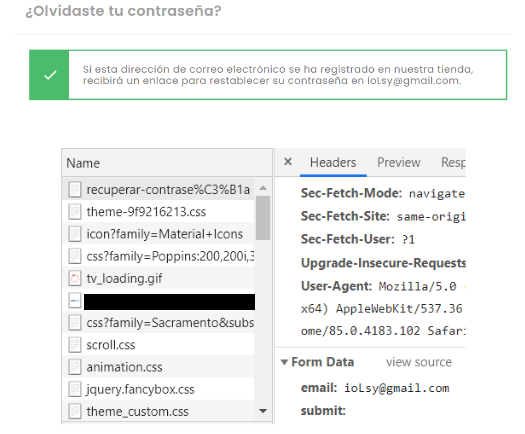
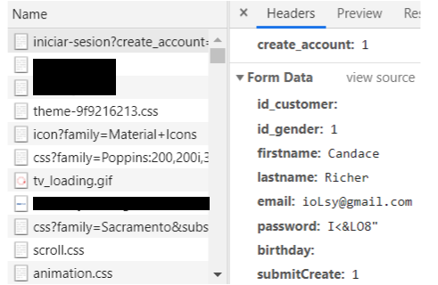

# Criptografía y seguridad en redes: Passwords

## Descripción
Auditación de implementación de los sistemas de creación, actualización, acceso, transmisión y recuperación de contraseñas de dos sitios distintos (uno chileno y uno perteneciente a la comunidad europea), automatizando el proceso mediante [Selenium](https://www.selenium.dev/documentation/webdriver/)

El código en Python automatiza lo siguiente:

* Creación de una cuenta
* Inicio de sesión (permitirá recrear ataques por fuerza bruta)
* Restablecimiento de contraseña (no requiere *login* del usuario)
* Modificación de contraseña (requiere *login* del usuario)

## Código

Funciones principales:

* Crear cuenta
* Inicio de Sesión.
* Restablecer contraseña sin necesidad de identificar previamente al usuario en cuestión.
* Modificación de contraseña identificando previamente al usuario en cuestión.

Funciones secundarias:

* Generador aleatorio de correos electrónicos que satisfacen los requisitos de los sitios auditados.
* Generador aleatorio de contraseña
* Generador aleatorio de nombres y apellidos

## Resultados
### Sitio Chileno

La contraseña admitida en este sitio debe poseer un largo mínimo de 5 caracteres y un máximo de 72. La base permitida son todos los caracteres del teclado (base 94), UNICODE, EMOJIS y UTF-8. Esto se verifica al ver el código HTML tanto al momento de querer registrar un usuario y en el proceso de modificación de contraseña.

_El largo máximo (72) se determinó modificando la contraseña de un usuario registrado a una de largo 73 para posteriormente ingresar la contraseña sin el ultimo carácter._

Para el restablecimiento de esta, se necesita una dirección de correo electrónico para verificar existe su registro en la base de datos. Esta ultima información no será notificada al usuario y, por ende, no existe información expuesta. Si existe el registro, se envía un link de restablecimiento al correo señalado en donde se podrá ingresar una nueva contraseña con las características ya señaladas.

#### Inicio de sesión

Requisitos

* Dirección de correo electrónico
* Contraseña

#### Modificar contraseña

Requisitos (_obligatorios_)

* Contraseña actual
* Contraseña nueva

#### Recuperar contraseña

Requisitos

* Dirección de correo electrónico

**Conclusión**: La gestión de datos personales es la misma que el sitio de Unión Europea: al intentar restablecer la contraseña de un usuario introduciendo el correo electrónico asociado, el sitio chileno no confirma en el momento si este está registrado.

####  Crear cuenta

Requisitos

* Genero.
* Nombre.
* Apellido(s).
* Dirección de correo electrónico.
* Contraseña.

#### Fuerza bruta 

Se inicia por registrar un usuario. Luego, se automatiza 100 intentos de ingresar a esta cuenta con una contraseña que no es la que corresponde al registro previo.

**Conclusión**: No se bloquea de ninguna forma el intento de ingreso durante los 100 ciclos.Al modificar el codigo sin tiempos de espera entre procesos, la pagina no presenta ningun sistema de bloqueo a comparación con la pagina de la Union Europea.
